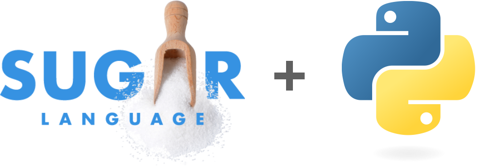

# <div align="center">sugarpy</div>

A library, API and web app for using NLP to perform language sample analysis using the [SUGAR](https://www.sugarlanguage.org/) framework. This is primarily meant as a tool for Speech Language Pathologists (SLPs) to expedite the often time-consuming process of computing SUGAR metrics by hand. The main mode of use for SLPs is the web application [here](https://languagesamples.app/). Behind the web application is an API hosted in Google Cloud. Documentation for that API is [here](https://sugarpy-mrjuj62msa-uc.a.run.app/docs).

The `sugarpy` python library is the core driver of the tool. It uses classical NLP (`spacy`) to perform rule-based and token based analysis on the input language samples. In the future, LLM support will be added to augment the tool and improve accuracy.

## Install

To install the python library, use pip:
```bash
pip install sugarpy
```

You can also clone this repo and install from source using poetry:
```bash
pip install poetry
poetry install
```

## Use

The main operation in `sugarpy` is `get_metrics`:

```python
from sugarpy import get_metrics

language_samples = [
  "My last name is Y and my middle name is Z",
  "And you can take this bag off and wear it",
  "But it’s a little small",
  "Yea mine didn’t come with one that matches" 
  "It didn’t come with this; it came with these markers"
]

metrics = get_metrics(language_samples)
```
The result is an object with the four SUGAR metrics as attributes: `mlu` (mean length utterance), `cps` (clauses per sentence), `wps` (words per sentence), and `tnw` (total number of words).


## License
